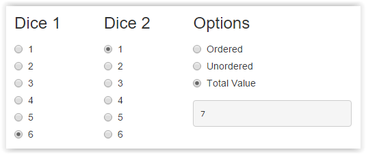
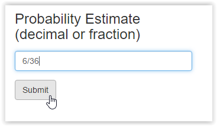
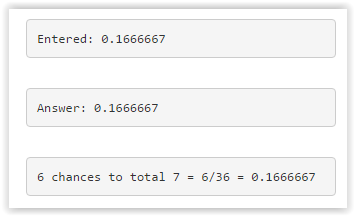
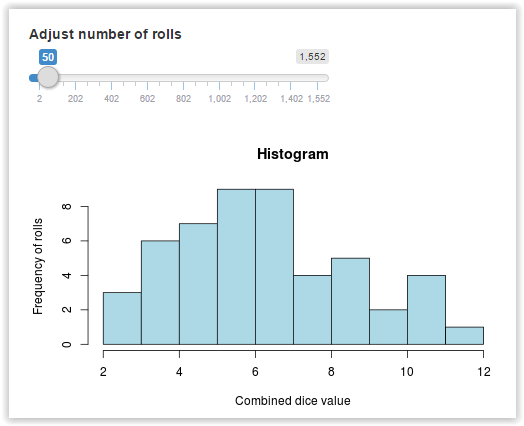
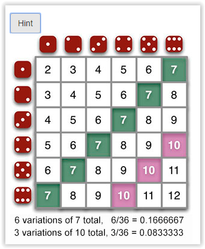

<style>
.small-code pre code {
  font-size: 1em;
}
</style>

Probability Quiz
========================================================
date:  November 21 2015 

A presentation of basic probability concepts via a quiz and accompanying 
instructional material.

- Introduces probability by educating a user to estimate the probability of scores 
  using a roll of 2 die 
- Illustrates the central limit theorem by giving the user a histogram of scores
  in response to increasing counts of rolls via a slider
- Presented in Shiny, using widget inputs and server calculations

Appearance of the Shiny appplication
========================================================

<small>
https://zohaggie.shinyapps.io/DataProducts
</small>

Features
========================================================
<small>
User can experiment with ordered (consecutive) rolls of 2 die, or 2 die rolled 
in any order, or any die combinations for a total value: 
</small>


***
<small>
In response to hitting the Submit button, the user's answer and the calculated 
probability are displayed, together with an explanation:
</small>


Features continued...
========================================================
<small>
User can also use a slider to experiement with adjusting a number of randomly
generated scores of 2 die rolls, to see how the distribution changes:
</small>

***
<small>
Although not visible upon starting the application, a Hint
button displays an image of possible die roll combinations:
</small>


========================================================
left: 45%
<small>
Sample code in server.R:

```r
set.seed(1010)
output$rollsHist <- renderPlot({
    hist(rowSums(replicate(2, sample(6, input$Rolls, replace=T))), 
    breaks = c(2, 3, 4, 5, 6, 7, 8, 9, 10, 11, 12), 
    col='lightblue', xlab='Combined dice value', ylab = 'Frequency of rolls',        main='Histogram')
}, height = 300, width = 500)
```
</small>
***
<small>
Code in UI.R, resulting Histogram:

```r
sliderInput('Rolls', 'Adjust number of rolls', value = 50, min = 2, max = 1552, step = 50),
plotOutput('rollsHist')
```
</small>
 

